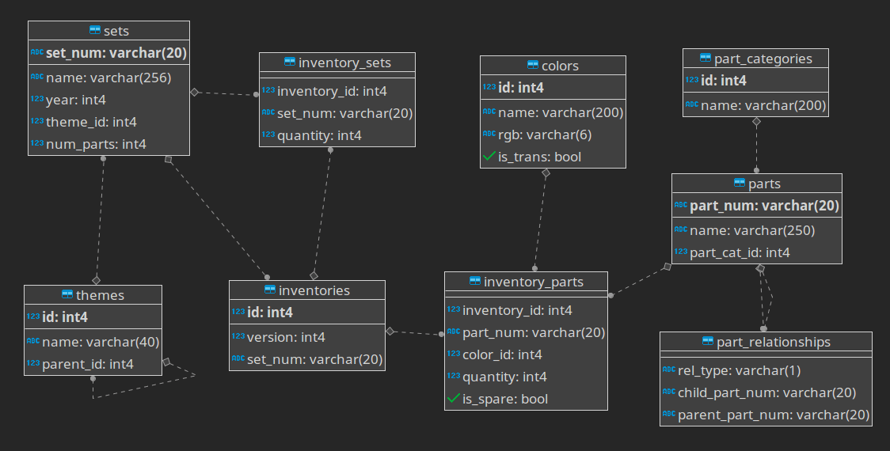
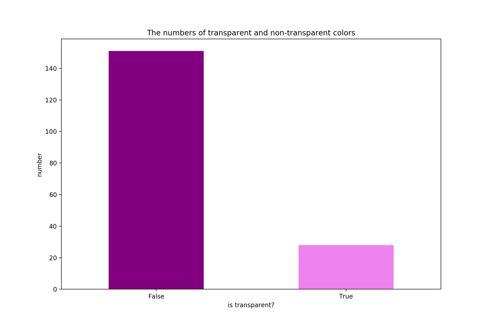
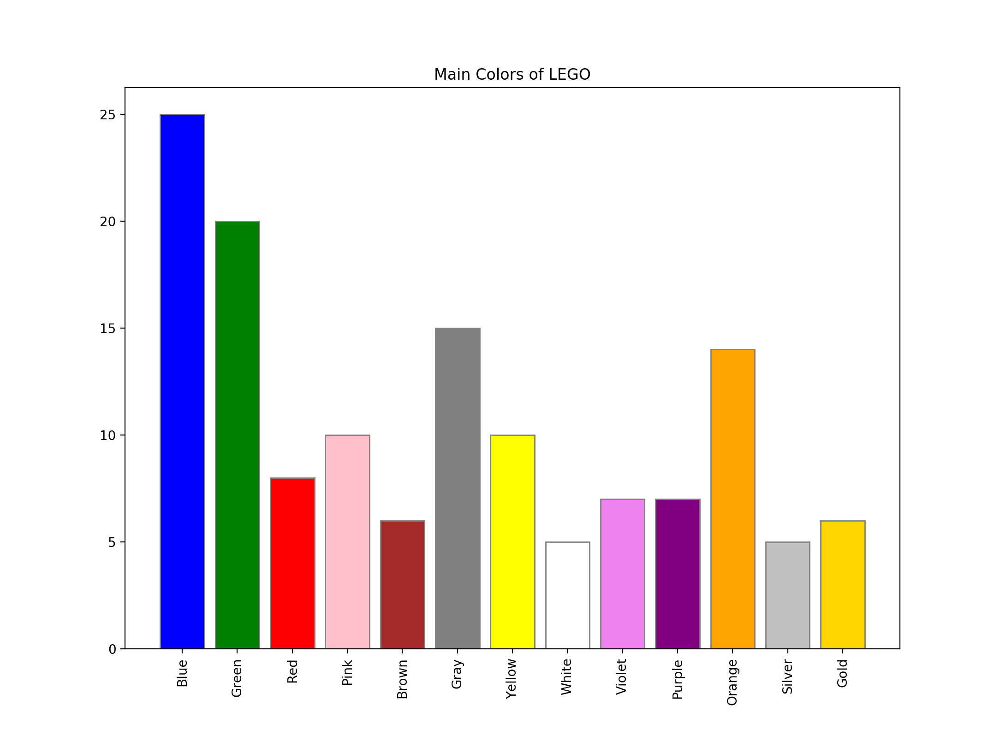
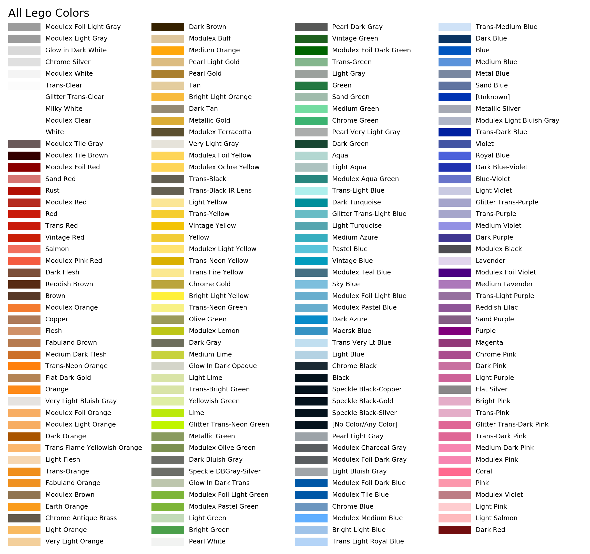
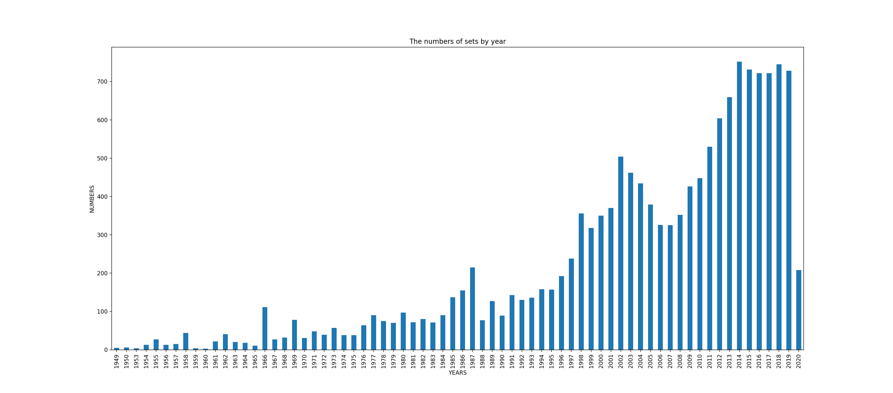
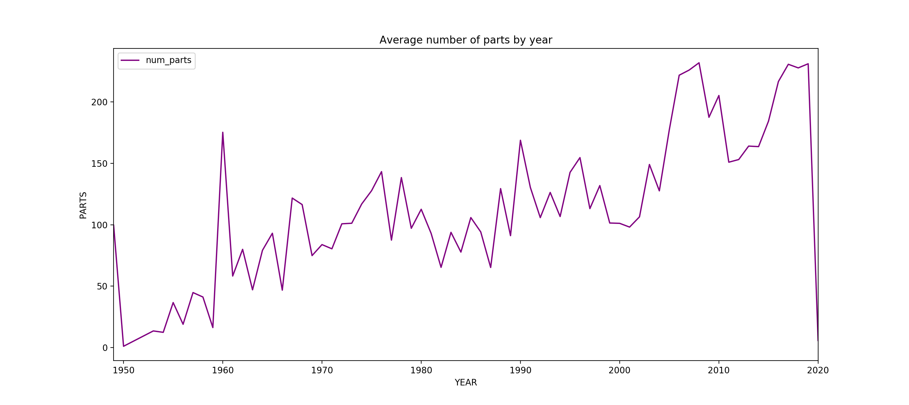

# Exploring The Data of LEGO History
A data exploration project on LEGO history in Python with pandas, matplotlib etc. (WIP)

<br>

***Data source : [Rebrickable](https://rebrickable.com/downloads/)***
<br>

---

## Dataset Informations


| Dataset | Description | Columns |
|--|--|--|
| `colors.csv` | This file contains information on LEGO colors, including a unique ID for each color, its name, and approximate RGB value, and whether it's transparent | `id` Unique ID for this color. <br><br>`name` The human-readable name of the color. <br><br> `rgb` The approximate RGB color. <br><br> `is_trans` Whether or not the given color is transparent/translucent.|
| `inventories.csv` | This table contains information on inventories, including a unique ID, it's version and the set number. | `id` Unique ID for this inventory entry. <br><br> `version` Version number. <br><br> `set_num` Set number (form `sets.csv`). |
| `inventory_parts.csv` | This table contains information part inventories, including a unique ID number, the part number, the color of the part, how many are included and whether it's a spare. | `inventory_id` Unique ID for the inventory this part is appearing in. This is the same as the id value in `inventories.csv`. <br><br> `part_num` Unique ID for the part. <br><br> `color_id` Unique ID for the color, as per `colors.csv`. <br><br> `quantity` The number of copies of this part included in the set! <br><br> `is_spare` Whether or not this is a spare part. Spare parts are additional parts not needed to finish the set. |
| `inventory_sets.csv` | This file contains information on what inventory is included in which sets, including the inventory ID, the set number and the quantity of that inventory that are included. | `inventory_id` Unique inventory ID from `inventories.csv`. <br><br> `set_num` Unique set ID from `sets.csv`. <br><br> `quantity` The quantity of the inventory included. |
| `part_categories.csv` | This dataset includes information on the part category (what type of part it is) and a unique ID for that part category. | `id` Unique ID for the part category. <br><br> `name` The category of stuff the part is in. |
| `part_relationships.csv` | This dataset includes information on the different relationships of parts. | `rel_type` Relationship type of the part. <br><br> `child_part_num` Child part category ID. <br><br> `parent_part_num` Parent category unique ID  |
| `parts.csv` | This dataset includes information on lego parts, including a unique ID number, the name of the part, and what part category it's from. | `part_num` Unique ID for the part. <br><br> `name` Name of the part. <br><br> `part_cat_id` Part category unique ID (from `part_categories.csv`). |
| `sets.csv` | This file contains information on LEGO sets, including a unique ID number, the name of the set, the year it was released, its theme and how many parts it includes. | `set_num` Unique set ID. <br><br> `name` The name of the set. <br><br> `year` Year the set was published. <br><br> `theme_id` Unique ID for the theme used for the set (from `themes.csv`). <br><br> `num_parts` The number of parts included in the set. |
| `themes.csv` | This file includes information on lego themes. Each theme is given a unique ID number, a name, and (if it's part of a bigger theme) which theme it's part of. | `id` Theme unique ID. <br><br> `name` Name of the theme. <br><br> `parent_id` Unique ID for the larger theme, if there is one. |

---

## Basic Understanding of Datasets

The schema of database :




---

## Exploring Colors

You can find source code of this section on `lego_colors.py` file.

<br>

**First rows of `colors.csv`**

```
   id            name     rgb is_trans
0  -1       [Unknown]  0033B2        f
1   0           Black  05131D        f
2   1            Blue  0055BF        f
3   2           Green  237841        f
4   3  Dark Turquoise  008F9B        f
```


<br>


| Data | Result | Detail |
|--|--|--|
| Colors | 179 | The number of colors available |
| Non-transparent | 151 | Number of non-transparent colors. |
| Transparent | 28 | Number of transparent colors. |

<br>







<br>

---

## Exploring Sets

You can find source code of this section on `lego_sets.py` file.

<br>

**First rows of `sets.csv`**

```
  set_num                        name  year  theme_id  num_parts
0   001-1                       Gears  1965         1         43
1  0011-2           Town Mini-Figures  1978        84         12
2  0011-3  Castle 2 for 1 Bonus Offer  1987       199          2
3  0012-1          Space Mini-Figures  1979       143         12
4  0013-1          Space Mini-Figures  1979       143         12
```








---

## Exploring Themes

You can find source code of this section on `lego_themes.py` file.

<br>

**First rows of `sets.csv`**

```
  set_num                        name  year  theme_id  num_parts
0   001-1                       Gears  1965         1         43
1  0011-2           Town Mini-Figures  1978        84         12
2  0011-3  Castle 2 for 1 Bonus Offer  1987       199          2
3  0012-1          Space Mini-Figures  1979       143         12
4  0013-1          Space Mini-Figures  1979       143         12
```

<br>

**First rows of `themes.csv`**

```
   id            name  parent_id
0   1         Technic        NaN
1   2  Arctic Technic        1.0
2   3     Competition        1.0
3   4  Expert Builder        1.0
4   5           Model        1.0
```
